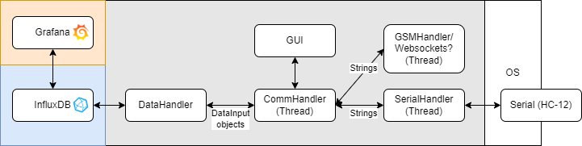

# chase car telemetry

solarenergyracers.ch chase car telemetry system

- Receives data from a serial port
- uploads data to an influx db
- offers UI to send commands
- can send messages to solar car

Requires an influxdb

## Communication Protocol
### Operation modes:

- Acknowledgement Mode: The chase car acknowledges every received dataset. For track races with unreliable connection.
- Disacknowledgement Mode: The chase car re-requests datasets that seem to be missing. For road races with somewhat reliable connection.

### Protocol

#### Sent by solar car

Data is generally transmitted in a comma separated format prefixed by d::
`d:timeStamp,uptime,msg,speed,acceleration,deceleration,accelerationDisplay,batteryOn,pvOn,pvCurrent,motorOn,motorCurrent,t1,t2,t3,t4,indicator,driveDirection,constantModeOn,sdCardDetected,displayStatus,constantMode,targetSpeed,targetPower,driverInfo,speedArrow,light,io\n`

CAN frames are transmitted with a c:: prefix
`c:timestamp,CAN_Address,data\n`

Command Acknowledgment
`a:request_number,success\n`

#### Sent by chase car
Ack Mode: data acknowledgment
`a:timestamp,type(d/c)\n`

Command Request
`r:request_number,command\n`

Re-request missing data
`m:request_number,timestamp_from,timestamp_to`